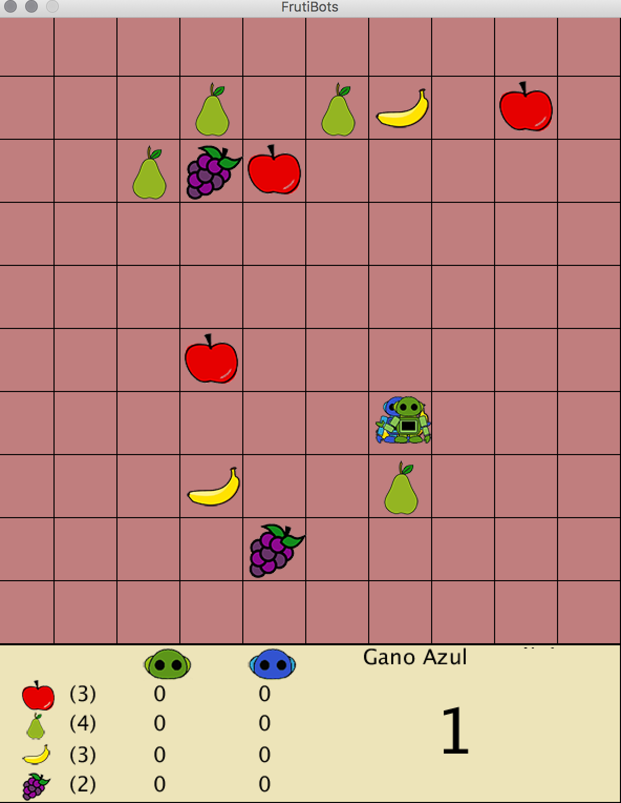

# FruitBotsGame

Is a game where two robots (the green one is the user and the blue one has IA implemented) compete to see who picks more fruits on the board.

The game starts with an nxn board that has as its initial state fruits of a certain category distributed randomly on the board and the robots have the same random initial position. The goal is for each robot, to have collected more fruits in as many categories as possible.

The IA technique is **decision trees**.

Inspired by [FruitBots](http://fruitbots.org/)

## Rules

The rules of the game are the following:

1. The robots can perform only one action at a time, moves (North, South, East, West) or collects
fruit.
2. Both robots move simultaneously.
3. If both collect the same fruit, it is destroyed.

### Prerequisites

Implemented with [Processing](https://processing.org/)
Version 2 is required.

### Developers
* Kimberly Becerril <kymy@ciencias.unam.mx>
* Hahn Martín-Lunas Susana

Developed in May 2015 

